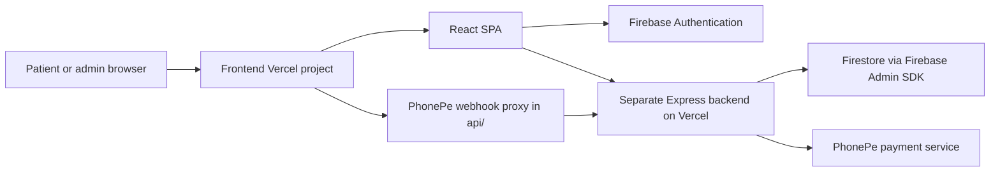

# Frontend architecture

This document describes the frontend as it is implemented in this repository. [Flows and backend API](./FLOWS_AND_API.md) covers requests that cross into the separate backend repository.

## System boundary

The frontend owns pages, form state, display rules, and client-side validation. It does not directly read or write appointment documents in Firestore. The backend is authoritative for slot counts, booking creation, payment status, clinic controls, and admin authorization. The frontend's Firebase SDK is used for Google sign-in and ID tokens.

## Startup and routing

1. `index.html` supplies the app root, initial metadata, favicons, and resource hints.
2. [`src/main.tsx`](../src/main.tsx) loads the Font Awesome subset and mounts `App` in React Strict Mode.
3. [`src/App.tsx`](../src/App.tsx) wraps the router in `AuthWrapper`.
4. [`src/AuthWrapper.tsx`](../src/AuthWrapper.tsx) restores the theme from a cookie, checks the current Firebase user, and keeps the Zustand admin state in sync with `onIdTokenChanged`. It does not block the first render while auth initializes.
5. [`src/Routing.tsx`](../src/Routing.tsx) owns the browser router, lazy page imports, shared navbar/footer, and floating controls.

| Route                                           | Page and purpose                                                                 |
| ----------------------------------------------- | -------------------------------------------------------------------------------- |
| `/`, `/home`                                    | Home and clinic information                                                      |
| `/about`, `/contact`, `/faq`, `/privacy-policy` | Informational pages                                                              |
| `/appointment`                                  | Appointment form, receipt lookup, payment return, and admin tools                |
| `/admin-login`                                  | Google sign-in; `ProtectedRoute` redirects an already signed-in admin to `/home` |

Page modules are loaded on demand with `React.lazy` and `Suspense`. The three appointment modals are also lazy-loaded. The shared navbar fetches public clinic status on initial load and refreshes it every five minutes.

## Folder map

| Path                                      | Responsibility                                                            |
| ----------------------------------------- | ------------------------------------------------------------------------- |
| `src/pages/`                              | Route-level screens and page composition                                  |
| `src/components/`                         | Appointment form, receipts, admin/search modals, and page sections        |
| `src/appComponents/`                      | Shared layout, navigation, route guard, loading UI, and floating controls |
| `src/appStore/`                           | Zustand store with Immer-backed admin, clinic, theme, and UI slices       |
| `src/services/`                           | Firebase Auth setup and calls to backend appointment/admin/payment APIs   |
| `src/hooks/`                              | Reusable theme, clinic-status, modal, and SEO behavior                    |
| `src/constants/`                          | Clinic schedule rules and image URLs                                      |
| `src/types/`                              | Booking and UI data shapes                                                |
| `src/utils/`                              | Receipt mapping, PDF generation, icons, logging, and small helpers        |
| `src/index.css`, `tailwind.config.ts`     | Tailwind styling and theme configuration                                  |
| `api/payment/`                            | Vercel functions forwarding PhonePe webhook requests to the backend       |
| `public/`                                 | Static assets, `robots.txt`, sitemap, and web manifest                    |
| `tests/__mocks__/`, `src/**/*.test.ts(x)` | Jest asset mocks and colocated tests                                      |
| `.github/workflows/`, `scripts/`          | CI checks and the install-script checker                                  |

`@/` resolves to `src/` in both [`vite.config.ts`](../vite.config.ts) and [`tsconfig.app.json`](../tsconfig.app.json). `dist/` is generated by the production build and is not source code.

## State and data ownership

- **Local component state** holds form values, selected dates, modal visibility, loading states, and receipt data. The appointment form validates fields before invoking the page's payment handler.
- **Zustand `adminSlice`** holds the allowlisted Firebase user and auth initialization state. Client-side email checks control UI visibility only; the backend checks tokens and its own admin email list.
- **Zustand `clinicSlice`** fetches the public clinic status endpoint and stores the manual-closure status and display message. `useClinicStatus` combines this with today's date for the booking UI.
- **Zustand `themeSlice`** applies the `dark` class and persists the choice in a cookie.
- **`appointmentService` slot cache** keeps backend slot counts in memory for 30 seconds. A forced refresh bypasses it after a successful payment return. This cache is a UI optimization, not a reservation or final availability check.

The clinic schedule in [`src/constants/clinicSchedule.ts`](../src/constants/clinicSchedule.ts) drives client-side date validation, visible hours, and the navbar's scheduled open/closed state. The backend has its own schedule validation in `src/utils/clinicSchedule.ts`; changes to booking policy must be coordinated across both repositories.

## SEO, assets, and build

[`index.html`](../index.html) supplies initial metadata for the SPA. [`src/hooks/useSEO.ts`](../src/hooks/useSEO.ts) updates each route's title, description, canonical link, social tags, and JSON-LD after client rendering. [`public/robots.txt`](../public/robots.txt) and [`public/sitemap.xml`](../public/sitemap.xml) are static. The site remains a client-rendered SPA; route metadata depends on JavaScript running.

Vite builds the React app with the React Compiler enabled and Oxc minification. Tailwind generates the CSS. [`vercel.json`](../vercel.json) contains the apex-to-www redirect, SPA rewrite, and response headers. The frontend `api/` functions are separate from the SPA bundle.

Run `bun run verify` for lint, formatting, type checks, tests, and dead-code analysis; run `bun run build` to produce the deployable `dist/`. These checks do not exercise live Firebase, PhonePe, browser navigation, or search-engine rendering. See [Flows and backend API](./FLOWS_AND_API.md) for the relevant integration paths.
